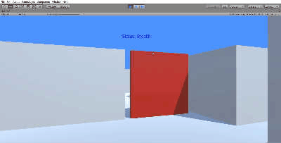

# MARL_project
Multi-Agent Reinforcement Learning Project.  Rutgers CS 2020
For more details, please check Technical Report.

# Muti-agent Imitation Learning In Hide & Seek

([ML in Unity](https://unity3d.com/machine-learning))
([ML-agents tool-kit](https://github.com/Unity-Technologies/ml-agents))

## Abstract

This project proposes modeling authentic chasing and escapingbehaviors for multi-agents in an enclosed environment where theagents play a competitive game with some interactive objects. Weare using deep reinforcement learning combined with imitationlearning to train agents to acquire emergent strategies such as tooluse, where agents can change the environment for reaching goals.We first use imitation learning to bootstrap the agent¡¯s policy usingbehavior from a player and train them to do some simple strategiessuch as chasing, hiding and using tools. After that, the agents canlearn to change their environment to catch the goal.

## Keyword

* **Multi-agent**
* **Unity ML-Tool kit**
* **Imitation learning**
* **Reinforcement Learning**
* **GAIL**

**First trainning result**

**Demo in First person view**

##Introduction

**Problem Statement:** Many situations in real world require artifi-cial agents.However, It is challenging to implement competitive and cooperative behavior in AI agent. Some modern computer gamesattempt to simulate such behavior, in which player and non-playerhostiles compete against each other to avoid being detected or tocatch others.However,their movements are pre-defined by behav-ior trees.With all commands being completely settled by scripts,those characters will only conduct rigid behavior with same patternsuch as following the player or moving along a fixed routine.They cannot dynamically adapt to player's behavior and evolve corre-sponding strategies, which limits their performance in a real-worldapplication.

**Motivation and Applications:**  We wish to implement an AI thatis capable of exerting complex strategies by racing between agentsas well as learning player's behavior in a computer-simulated sit-uation. We are trying to solve this problem with some advancedmachine learning methods including deep reinforcement learning,imitation learning and GAIL with limited resources and we alsowant to explore further for AI in an imperfect information game.

**Challenges:**  Adaption to dynamic environment. Strategies shouldadapt to complicate and changeable obstacles, such as S-shapechannels that may cause dead loop. Multi-agent cooperation strate-gies(baiting, intercepting), Which requires multi-agent trainingmethod where different agents have relative rewards, states andactions. Reinforcement learning with combined rewards. A singlereward policy is clear and straightforward to guide the escapee tothe exit, but is limited in providing feedback of valuable strategiesto the algorithm. Multiple behavioral reward, on the other hand,strengthen beneficial short-term strategies while overlooking theprimary objective of reaching the exit.

**Technical Innovations**.  The combination of Imitation Learning and Deep reinforcement learning can dramati-cally reduce the time the agents take to solve the environment. 

##Methods##

* Training is performed with a combination of deep reinforcementlearning(**DRL**) and Generative Adversarial Imitation Learning(**GAIL**).

* DRL:The goal of reinforcement learning is to learn a policy,which is essentially a mapping from observations to actions.Extrinsic procedurea)Observation. Agent's observation of en-vironment as well as its opponent is based on simulation of viewby having several rays emit from the agent. If the rays hit anyobject(the other agents, walls, etc), values indicating the distanceand position will be returned to the agent. b)Action. Agent's actionspace is move forward, move backward, turn left and turn right.After each action the agent will transit to another state with newobservation. c).Reward. Reward is evaluated by current state.theescapee win 1 point if it arrives the exit and lose 1 point if it iscaught or time up. The chaser has the converse reward.

* Intrinsic procedure (GAIL):

Generative Adversarial Imitation Learning, is a new general framework for directly extracting apolicy from data. It is used to solve the problem of sparse reward in DRL.In this framework, a neural network, the discriminator, is taughtto distinguish whether an observation/action is from a demonstra-tion or produced by the agent. This discriminator can the examinea new observation/action and provide it a reward based on howclose it believes this new observation/action is to the provideddemonstrations. In the training process, for each action the agentmake, the discriminator produce a reward based on how similarthe action is to the actions in the demo. After getting the reward received from GAIL, we send it as one of the intrinsic reward signal to the reinforcement learning model. Then the agent would tryto maximize the reward, thus encouraging the agent to mimic the behaviors in the demo. As the agent making actions more and more similar to the demo actions, the discriminator also keeps trainingon those more similar actions. Thus the discriminator is becoming more and more accurate.

